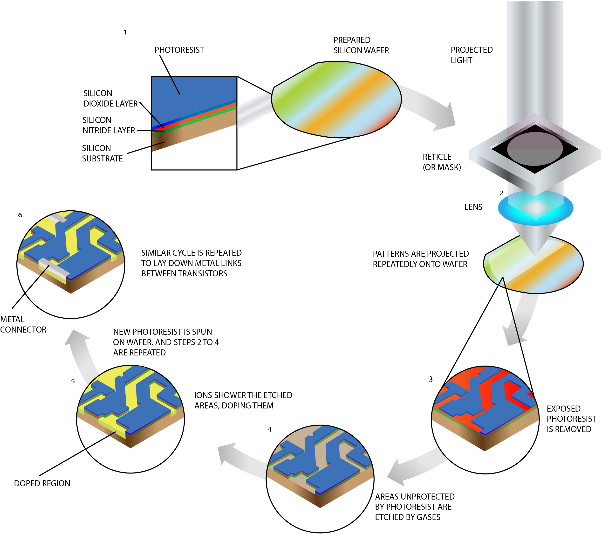
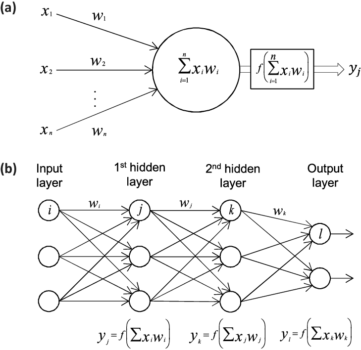
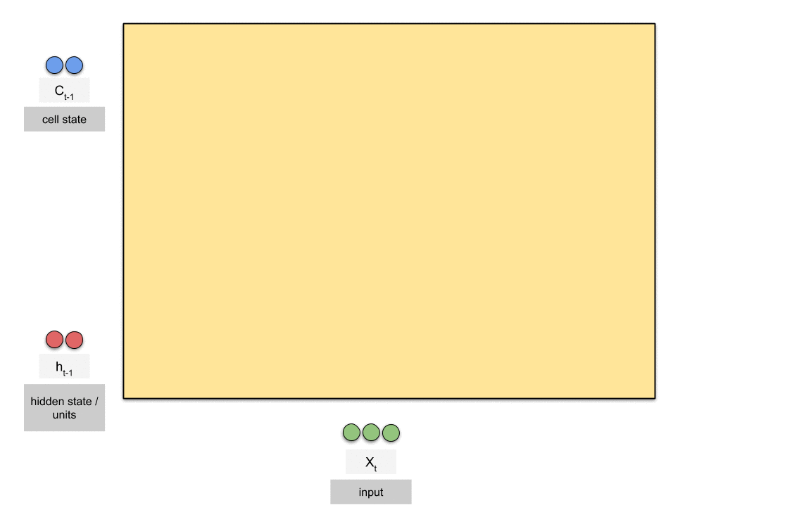
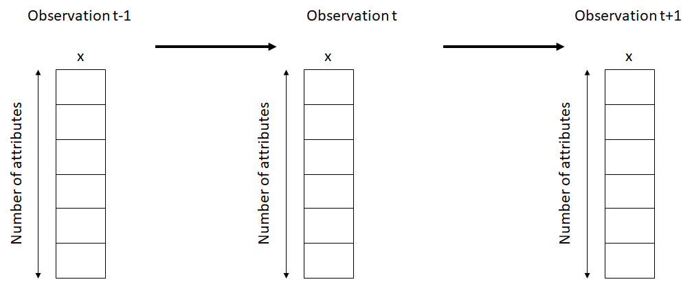
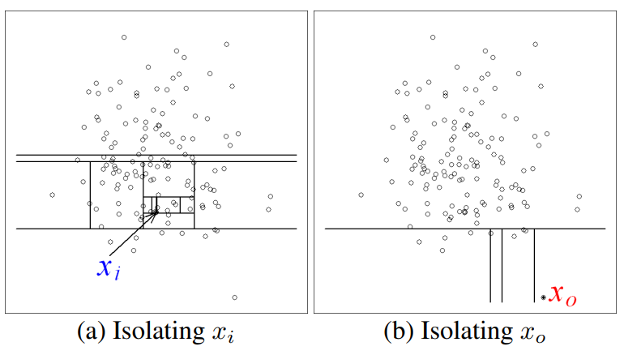

```{r setup, include=FALSE}
knitr::opts_chunk$set(echo = TRUE,
                      eval = T)
```

# Introduction

In electronics, a wafer is a thin slice of semiconductor used for the fabrication of integrated circuits and, in photovoltaics, to manufacture solar cells. The wafer serves as the substrate for microelectronic devices built in and upon the wafer. 

```{r fig.align="center", out.width="80%", fig.align='center', eval=TRUE, echo=FALSE}

```

The following is the general flow of semiconductor wafer fabrication process [^1]:

1. A silicon wafer has been prepared from an ingot by cutting and polishing. The wafer then has layers of material applied. These include a silicon oxide layer, a silicon nitride layer and a layer of photoresist.

2. A light is then projected through a reticle and a lens unto the wafer surface. This pattern is projected numerous times onto the wafer for each chip.

3. The photoresist that was exposed to the light can now be chemically removed.

4. The areas where the photoresist has been removed can now be etched, which in the case above, is done by gases.

5. An ionic gaseous stream showers the chip and “dopes” those regions that were exposed due to etching. New photoresist can be applied to the wafer and steps 2-4 are repeated.

6. In a similar repeated cycle, metal links can be laid down between transistors.Every step of the process requires elastomer seals to isolate the process from the outside atmosphere. 

```{r fig.align="center", out.width="80%", fig.align='center', eval=TRUE, echo=FALSE}

```

Due to the size of the semiconductor and the complex and delicate process that goes along with it, any defect during production seems cannot be avoided. In the wafer industry, a defect is the number one enemy. Any forms of defect can greatly affect the quality of the silicon wafer, even the scratches which are not visible to the eye matters. A lot of manufacturer use sensors to monitor the condition during the fabrication process to make sure any kind of abnormality is detected early. Building an automated inspection will be very beneficial for the manufacturer, as shown by the number of research that study the defect detection or pattern seeking on this field. In this article, I will illustrate how machine learning can be applied to detect abnormality in the fabrication process.

# Library and Setup

If you are interested to reproduce the code in this article, here is the required library and setup.

```{r message=FALSE, warning=FALSE}
library(tidyverse)
library(tidymodels)
library(scales)
library(plotly)
library(keras)
library(isotree)

options(scipen = 999)

use_condaenv()
```

# Data

The data comes from <a href = "http://timeseriesclassification.com/description.php?Dataset=Wafer"> R. Olszewski's study </a> on semiconductor fabrication process. The description of the data below are directly cited from the website.

> "A collection of inline process control measurements recorded from various sensors during the processing of silicon wafers for semiconductor fabrication constitute the wafer database; each data set in the wafer database contains the measurements recorded by one sensor during the processing of one wafer by one tool. The two classes are normal and abnormal. There is a large class imbalance between normal and abnormal (10.7% of the train are abnormal, 12.1% of the test)"

```{r}
data_train <- foreign::read.arff("data_input/semiconductor/Wafer_TEST.arff") %>% 
  mutate(target = as.numeric(target)-1)

data_test <- foreign::read.arff("data_input/semiconductor/Wafer_TRAIN.arff") %>%
  mutate(target = as.numeric(target)-1)

head(data_train %>% select(target, everything()))
```

# Exploratory Data Analysis

We will do exploratory data analysis to get better understanding about the data, which can help us to prepare the data properly before feeding them into the machine learning model.

## Correlation Between Variables

Let's see the correlation between features/variables. Since we have a lot of feature, around 152 measurements from the sensors, if there are a lot of correlating variables, we can compress them to reduce the dimensions using Principal Component Analysis (PCA). Lower number of dimensions means that we can train the model faster.

```{r warning=FALSE}
p1 <- cor(data_train %>% select(-target)) %>% 
  as.data.frame() %>% 
  rownames_to_column(var = "column") %>% 
  pivot_longer(cols = -column, names_to = "pair", values_to = "value") %>% 
  ggplot(aes(column, pair, fill = value, 
             text = glue::glue("Pairwise : {column}, {pair}
                   Correlation : {number(value, accuracy = 0.001)}"))) +
  geom_tile()+
  theme_minimal()+
  scale_fill_gradient2(low = "dodgerblue4", mid = "white", high = "red4")+
  theme(axis.text = element_blank(),
        axis.ticks = element_blank())+
  labs(title = "Correlation Between Variables", x = NULL, y = NULL, fill = "Correlation")

ggplotly(p1, tooltip = "text")
```

## Class Imbalance

Let's check the class imbalance to prove the description about the data. First we check the proportion of each target in the training set.

```{r}
prop.table(table(data_train$target))
```

Here is the proportion of class imbalance in the test dataset.
```{r}
prop.table(table(data_test$target))
```

The target class in training and testing dataset is highly imbalance, with very few of the abnormal state (0) presence in the data. This kind of class imbalance will make our model harder to detect them. We can either build a classification model or an outlier detection model. On this occasion, I will illustrate how to handle the problem with both approach. I will build a Neural Network model to classify the data based on the target and build an Isolation Forest model to detect any anomaly in the data.

# Data Preprocessing

Before we feed the data into the model, we will preprocess the data. The first step is to scale all the features so that they have the same variance of 1. This is done in order to give all features the same weight and no single features will distort the model just because it has higher or bigger range of data. The second step is do Principal Component Analysis (PCA). Based on the exploratory data analysis, some of the features are highly correlate with each others, so instead of using the original 152 features, we will reduce the dimensions that will still contain 99% of the total variation of the data.

```{r}
rec <- recipe(data_train) %>% 
  step_scale(all_numeric(), -target) %>%   
  step_pca(all_numeric(), -target,threshold = 0.99) %>% 
  prep()

data_train <- juice(rec) %>% 
  select(2:51, target)
data_test <- bake(rec, data_test) %>% 
  select(2:51, target)

head(data_train)
```

Based on the preprocessing steps, now we have only 50 features and 1 target column instead of the original data, which has 152 features.

# Cross-Validation

We will split the testing dataset into validation set and testing set with equal split (30:70), with 30% of the data test will used as validation set. 

So, we will have 3 kind of datasets. The training set will be used to train the model. The validation set will used to evaluate the model while we tuned the hyper-parameter of the model. And lastly, the testing set will used as a final evaluation of our model performance.

```{r}
set.seed(123)
index <- nrow(data_test)*0.3

data_validation <- data_test[1:index, ]
data_testing <- data_test[(index+1):nrow(data_test), ]
```

# Build Neural Network Architecture

## General Multilayer Perceptron (MLP)

Neural Network is inspired by the biological neural network system of our brain. It consists of input layer, hidden layer, and output layer. The data will be fed into the input layer, processed through the hidden layer, and converted into specific values, such as probability, in the output layer. The MLP has a back-propagation feature, which means that it will go back and forth to adjust the weight of each connection between neurons in order to minimize the loss function and get better performance.

```{r fig.align="center", fig.width=80, eval=TRUE, echo=FALSE, fig.align='center'}

```

We will to convert the data to suit the `keras` infrastructure.

```{r}
x_train <- data_train %>% select(-target) %>% data.matrix()
y_train <- to_categorical(data_train$target, num_classes = 2)

x_val <- data_validation %>% select(-target) %>% data.matrix()
y_val <- to_categorical(data_validation$target)

x_test <- data_testing %>% select(-target) %>% data.matrix()
y_test <- to_categorical(data_testing$target)
```

### Neural Network Architecture

After the data is ready, now we can build the neural network architecture. Here, I build the MLP model with 3 layer dense. The first layer has 32 units of hidden neuron, with the input shape size is the same as the number of features. The second layer has 16 hidden neurons, and the last layer consists of 2 hidden neurons, the same as the number of target class (normal and abnormal). All layers use the `sigmoid` activation function.

```{r}
input_n <- length(data_test)-1

model <- keras_model_sequential() %>% 
  layer_dense(input_shape = input_n,
              units = 32, activation = "sigmoid") %>%
  layer_dense(units = 16, activation = "sigmoid") %>% 
  layer_dense(units = 2, activation = "sigmoid")

# compile
model %>% 
  compile(optimizer = "adam",
          metric = "accuracy",
          loss = "binary_crossentropy")

model
```

### Model Fitting

Now we train the NN model. The model will propagate/iterate in 40 epochs so it has time to learn and adjust the weight on each hidden neurons in order to minimize the loss function, which is binary cross entropy. If the loss function start to stagnate, then the model is converged.

```{r}
set.seed(123)
# model fit settings
epochs <- 40
batch_size <- 512

# fit the model
history <- model %>% fit(
  x_train, y_train,
  batch_size = batch_size, 
  epochs = epochs,
  verbose = 0,
  validation_data = list(
    x_val, y_val
  )
)

plot(history)
```

After around 10 epoch/iteration, the model start to converge and didn't improve any further. The model have an impressive performance, with 90% accuracy on training dataset and on validation dataset. We shall further analyze the performance  by using the testing dataset.

### Model Evaluation

Sometimes accuracy is not a good representation of the model performance, especially if the data has a highly imbalanced class such as ours. We will also need to consider other metrics, such as the `precision` and `recall`. We can also look at the `F1 score` that seek balance between precision and recall.

```{r warning=FALSE}
pred_test <- data.frame(actual = data_testing$target,
                        pred = predict(model, x_test)) %>% 
  mutate(pred = ifelse(pred.1 < 0.05, 0, 1)) %>% 
  mutate(actual = factor(actual, levels = c("0","1")),
         pred = factor(pred, levels = c("0","1")))

pred_test %>%
  summarise(accuracy = accuracy_vec(actual, pred),
            recall = sens_vec(actual, pred),
            specificity = spec_vec(actual, pred),
            precision = precision_vec(actual, pred),
            'F1 score' = 2*(precision*recall)/(precision + recall))
```

Based on the performance metrics, the accuracy is not good enough. Moreover, the model has a very low both recall and precision, which imply that our model has difficulty to detect the positive class (here, the abnormal state). Based on this result, a simple neural network model is not enough to handle our problem. We need to build better model. Next, I will try to build an NN model with LSTM (Long-Short Term Memory) that is proven to be effective for this case.

## LSTM (Long-Short Term Memory)

Since our data is consists of sensor reading from a sequenced process, we can consider them as a time series data, with each observation represent a single timestep. Thus the observation is ordered. Just like in text mining, where previous words can heavily alter the meaning of a sentence, the information from the previous observation may can give context to the current observation. This problem belong to a group called Time series classification (TSC). TSC problems are differentiated from traditional classification problems because the attributes/observations are ordered[^2]. Whether the ordering is by time or not is in fact irrelevant. The important characteristic is that there may be discriminatory features dependent on the ordering.

LSTM is a layer in deep learning that is often employed to sequenced data such as time series forecasting and NLP (natural language processing), where the model is expected to read text as a sequence rather than a collection of single word. The benefit of LSTM is that it can handle the phenomenon called *Vanishing Gradient*, where the updated weight decreased as it travel back through the layers. LSTM are explicitly designed to avoid the long-term dependency problem. 

Here is an illustration from <a href = "https://developpaper.com/gif-animation-parsing-rnn-lstm-gru/"> developpaper </a>. 

```{r fig.align="center", fig.width=80, eval=TRUE, echo=FALSE, fig.align='center'}

```

The main part of LSTM is the cell state, which run straight horizontally. Along the way, additional information will be controlled and led to the cell state by 3 kind of gates: forget gate, input gate and output gate. The forget gate functioned to *forget* previous information whenever a new information is coming. The decision to forget information is handled by the sigmoid (S) function.  Next, we decide what new information we are going to store in the cell state. The input gate consists of two part: the sigmoid layer to decide which part of the cell state will be updated and tanh (T), which functioned to decide what will be the new candidate value is. The multiplication of those two parts will update part of the cell state that has been forgotten by the forget gate. The output gate controls what will be the output to be fed into the current hidden state/units. The sigmoid layer will decide what part of the cell state that will be output, then multiply it with the cell state that has been through the tanh layer.

Further explanation and use case is available on Algotech[^3] and Colah[^4].

We will keep using the PCA to cut the computational time and also to see if PCA is still relevant for this kind of problem. Before we proceed, we will transform the data to suit the LSTM Neural Network model. The input will be something like the figure below. Thus, we will create a 3-dimensional array for the input of LSTM, with x-axis is the time step, y-axis is the number of features, and the z-axis is the 1(consists only of the value for each attributes/features). 

```{r fig.align="center", fig.width=80, eval=TRUE, echo=FALSE}

```

```{r}
make_3d <- function(x){
  xrow <- nrow(x)
  ycol <- ncol(x)
  array_3d <- array(0, dim = c(ycol-1, 2, xrow))
  for (i in 1:nrow(x)) {
    array_3d[ , 1, i] <- x[i, ] %>% select(-ycol) %>% t()
    array_3d[ , 2, i] <- rep(x %>% dplyr::slice(i) %>% select(ycol) %>% as.numeric(), ycol-1)
  }
  return(array_3d)
}

data_train_3d <- make_3d(data_train)
data_test_3d <- make_3d(data_testing)
data_val_3d <- make_3d(data_validation)
```

Let's check the dimentions of our 3-dimensional array
```{r}
dim(data_train_3d)
```

The array still contain both the value of each features and the value of the target. Now we will separate the input and the output.

```{r warning=FALSE, message=FALSE}
k <- backend()
x_train <- k$expand_dims(data_train_3d[ , 1, ] %>% t(), axis = 2L)
x_test <- k$expand_dims(data_test_3d[ , 1, ] %>% t(), axis = 2L)
x_val <- k$expand_dims(data_val_3d[ , 1, ] %>% t(), axis = 2L)

y_train <- data_train_3d[ , 2, ] %>% t() %>% k$expand_dims(axis = 2L)
y_test <- data_test_3d[ , 2, ] %>% t() %>% k$expand_dims(axis = 2L)
y_val <- data_val_3d[ , 2, ] %>% t() %>%  k$expand_dims(axis = 2L)

y_train <- y_train[ ,1]
y_val <- y_val[ ,1]
y_test <- y_test[ ,1]
```

Let's check the dimensions for the input
```{r}
dim(x_train)
```

Let's check the dimension of the output
```{r}
dim(y_train)
```

### Neural Network Architecture

Now we build the architecture. The model will have 3 layers: LSTM, flatten, and dense. The LSTM layer is built to read the sequence of the input. The flatten layer functioned to convert the 3-dimensional output from LSTM to 2-dimensional array that will be fed into the layer dense. The layer dense with sigmoid activation function will predict the probability that the observation belong to certain class.

```{r}
dim_n <- dim(x_train)
  
model_lstm <- keras_model_sequential() %>% 
  layer_lstm(units = 100, 
             return_sequences = T, 
             input_shape = c(dim_n[2], 1)) %>% 
  layer_flatten() %>% 
  layer_dense(units = 1, activation = "sigmoid")

model_lstm %>% 
  compile(optimizer = "adam",
          metric = "accuracy",
          loss = "binary_crossentropy",
          callbacks = callback_tensorboard("logs/run_a"))

model_lstm
```

### Model Fitting

Now we fit or train the model and see the result.

```{r}
set.seed(123)
# model fit settings
epochs <- 15
batch_size <- 512

# fit the model
history <- model_lstm %>% fit(
  x_train, y_train,
  batch_size = batch_size, 
  epochs = epochs,
  verbose = 0,
  validation_data = list(
    x_val, y_val)
)

history
```

As we can see, the LSTM model has a really good accuracy on both training set and validation set. The model converge before the 10th epoch.

```{r}
plot(history)+
  theme(legend.position = "top")
```

### Model Evaluation

Now we measure the model performance to if the model actually works.

```{r}
pred_test <- data.frame(actual = data_testing$target,
                        prob = predict(model_lstm, x_test)) %>% 
  mutate(pred = ifelse(prob < 0.5, 0, 1)) %>% 
  mutate(actual = factor(actual, levels = c("0","1")),
         pred = factor(pred, levels = c("0","1")))

pred_test %>%
  summarise(accuracy = accuracy_vec(actual, pred),
            recall = sens_vec(actual, pred),
            specificity = spec_vec(actual, pred),
            precision = precision_vec(actual, pred),
            F1 = 2*(precision*recall)/(precision + recall))
```

Based on the result, all metrics show promising result, with more than 90% of recall and precision. This means that almost all of the postive class (abnormal state) is correctly predicted. Using PCA for this kind of problem still effective.

Another metric that we can use is ROC Curve. ROC curve is a performance measurement for classification problem at various thresholds settings. ROC is a probability curve and it tells how much model is capable of distinguishing between classes. Good model should have curve above the dashed linear line, which represent the result if we classifying by random guess. The closer the line toward the top left corner, the better the model is.

```{r}
pred_test %>% 
  roc_curve(actual, prob) %>% 
  autoplot()
```

We've sucessfully built a classifier model to detect abnormal state in semiconductor fabrication process. Now we will proceed to apply anomaly detection for the same problem.

# Anomaly Detection with Isolation Forest

Anomaly detection is often used to handle a problem with imbalance class and generally work better than classification model such as K-NN or Naive Bayes. First, we look at the position of the `abnormal` observation in the generated dimension of `PC01` and `PC02`. We will merge both training set and testing set and see if they are truly distinguishable from the `normal` state.

```{r}
data_train %>% 
  bind_rows(data_test) %>% 
  select(target, everything()) %>% 
  mutate(abnormal = ifelse(target == 1, "Normal", "Abnormal")) %>% 
  ggplot(aes(PC01, PC02, color = abnormal)) +
  geom_point(alpha = 0.5) +
  ggthemes::theme_pander()+
  labs(title = "Anomaly in the Dataset",
       color = NULL)+
  scale_color_manual(values = c("firebrick", "skyblue"))+
  theme(legend.position = "top")
```

There are some `abnormal` observations inside of the two major cluster, which can be easily detected. However, most of the `abnormal` observations are gathered close to the `normal` one. This may make them harder to detect. We will proof it in the following section.

In order to do anomaly detection, we will use `Isolation Forest` model, which has the same concept of Random Forest model in classification problem. Isolation Forest adopt the concept of tree method in order to detect a distinct or a distanced observation. However, the output is kinda different. In Isolation Forest, the output is anomaly score, while in Random Forest the output is the probability of belonging into a specific class. 

```{r fig.align="center", out.width="80%", fig.align='center', eval=TRUE, echo=FALSE}

```

> "The term isolation means ‘separating an instance from the rest of the instances’. Since anomalies are ‘few and different’ and therefore they are more susceptible to isolation. In a data-induced random tree, partitioning of instances are repeated recursively until all instances are isolated. This random partitioning produces noticeable shorter paths for anomalies since (a) the fewer instances of anomalies result in a smaller number of partitions – shorter paths in a tree structure, and (b) instances with distinguishable attribute-values are more likely to be separated in early partitioning. Hence, when a forest of random trees collectively produce shorter path lengths for some particular points, then they are highly likely to be anomalies."
> `r tufte::quote_footer('Liu et al.')`

The complete step-by-step on Isolation Forest can be found on Liu et al.[^5] study.

### Model Fitting

Since the data has been preprocessed earlier, we can now directly feed them into the model. The Isolation Forest come from `isotree` package.

```{r}
data_train_e <- data_train %>% 
  mutate(target = factor(target, levels = c(0,1)))

iforest <- isolation.forest(data_train_e, random_seed = 123)

summary(iforest)
```

### Model Evaluation

As I mentioned earlier, the output of the Isolation Forest is anomaly score. For any given observation of x:

* If anomaly score is close to 1 then x is very likely to be an anomaly
* If anomaly score is smaller than 0.5 then x is likely to be a normal value
* If for a given sample all instances are assigned an anomaly score of around 0.5, then it is safe to assume that the sample doesn't have any anomaly

I will classify the prediction of Isolation Forest with threshold of 0.5. If the anomaly score is more than 0.5, than it will be tagged as anomaly.

```{r}
iso_data_train <- data_train_e %>% 
  mutate(target = ifelse(target == 1, "No", "Yes") %>% factor(levels = c("Yes", "No")),
         anomaly_score = predict(iforest, data_train),
         outlier = ifelse(anomaly_score > 0.5, "Yes", "No") %>% factor(levels = c("Yes", "No"))) 

iso_data_train %>% 
  ggplot(aes(x = anomaly_score))+
  geom_density(fill = "skyblue", alpha = 0.7, color = "skyblue")+
  ggthemes::theme_pander()+
  scale_x_continuous(breaks = seq(0,1,0.05))+
  labs(title = "Distribution of Anomaly Score",
       x = "Anomaly Score")+
  theme(panel.grid.minor = element_blank())
```

Based on the distribution of the anomaly score, most of the data has anomaly score around 0.35. There are some observations that has anomaly score of more than 0.5.

Next, we will measure the model performance, just like we measure the NN model.

```{r}
set.seed(123)
iso_data_train %>% 
  summarise(accuracy = accuracy_vec(target, outlier),
            recall = sens_vec(target, outlier),
            specificity = spec_vec(target, outlier),
            precision = precision_vec(target, outlier))
```

Despite having a good accuracy, the Isolation Forest still failed to sucessfully detect `abnormal` state, which is shown by the low value of recall and precision. We can also inspect them visually. 

```{r}
iso_data_train %>% 
  mutate(state = case_when(outlier == "Yes" ~ "Detected Abnormal State",
                           target == "No" ~ "Normal",
                           TRUE ~ "Undetected Abnormal State")) %>% 
  ggplot(aes(PC01, PC02)) +
  geom_point(aes(color = state))+
  scale_color_manual(values = c("firebrick", "skyblue", "orange"))+
  ggthemes::theme_pander() +
  labs(title = "Outlier Detection on Training Dataset",
       color = NULL) +
  theme(legend.position = "top")
```

There are so many `abnormal` obervations that are not detected by the Isolation Forest. This is not surprising, since the concept of Isolation Forest is detecting any presence of outlier, value that is isolated or distinguishable than the others. However, some `abnormal` observations have values almost similar to the `normal` observations, making them less likely to be called an outlier. Therefore, only the isolated one, observations that is positioned between two clusters, are detected by the Forest. An interesting finding is that most of the observation that has negative value of `PC01` is less likely to be detected. We will go into this later.

Next, we measure the model performance for the testing dataset.

```{r}
iso_data_test <- data_test %>% 
  mutate(target = ifelse(target == 1, "No", "Yes") %>% factor(levels = c("Yes", "No")),
         anomaly_score = predict(iforest, data_test),
         outlier = ifelse(anomaly_score > 0.5, "Yes", "No") %>% factor(levels = c("Yes", "No"))) %>% 
  select(target, anomaly_score, outlier, everything())

iso_data_test %>% 
  summarise(accuracy = accuracy_vec(target, outlier),
            recall = sens_vec(target, outlier),
            specificity = spec_vec(target, outlier),
            precision = precision_vec(target, outlier))
```

The result is similar to the training dataset, the model failed to correctly detect abnormal observation. We will also inspect them visually.

```{r}
iso_data_test %>% 
  mutate(state = case_when(outlier == "Yes" ~ "Detected Abnormal State",
                           target == "No" ~ "Normal",
                           TRUE ~ "Undetected Abnormal State")) %>% 
  ggplot(aes(PC01, PC02)) +
  geom_point(aes(color = state))+
  scale_color_manual(values = c("firebrick", "skyblue", "orange"))+
  ggthemes::theme_pander() +
  labs(title = "Outlier Detection on Test Dataset",
       color = NULL) +
  theme(legend.position = "top")
```

Just like in the training set, `abnormal` observation that is close to the `normal` observations is unlikely to be detected by the model. An interesting take is that observation with negative value of `PC01` is unlikely to be detected. It also happened in the training dataset. We may want to see what features are contributing to the `PC01`.

### PCA 

First, to give context, we will look at the contribution of each PC dimensions toward the total information/variance.

```{r}
pca_step <- rec$steps[[2]][7]
pca_var <- pca_step$res$sdev^2
data.frame(pc = 1:length(pca_var),
           var = pca_var,
           prop = pca_var/sum(pca_var)) %>%
  head(10) %>% 
  ggplot(aes(x = as.factor(pc), y = prop))+
  geom_col(fill = "firebrick")+
  geom_text(aes(label = percent(prop, accuracy = 0.01)), nudge_y = 0.05)+
  scale_y_continuous(breaks = seq(0,1, 0.2),
                     labels = percent(seq(0,1, 0.2)))+
  ggthemes::theme_pander()+
  theme(panel.grid.minor = element_blank())+
  labs(title = "Contribution of Each Principal Component",
       subtitle = "PC 1 Contribute to more than 65% of the total variance",
       x = NULL, y = NULL)
```

Turns out with only 5 first PCs, we can keep around 85% of the total information, with the first PC (PC1) contribute to more than 65% of the total information.

Now we will observe the loading factor of each features to `PC1` and `PC2` and visualize them. The loading factor is extracted from the rotation matrix. The loading factor represent the degree of influence of each features. Features with loading factor close to 0 means that it has almost no contribution toward the component.

```{r}
pca_step$res$rotation %>% 
  as.data.frame() %>% 
  rownames_to_column("feature") %>% 
  ggplot(aes(PC1, PC2))+  
  geom_segment(aes(x = 0, xend = PC1, y =0, yend= PC2), color = "skyblue")+
  geom_hline(yintercept = 0, color = "gray30")+
  geom_vline(xintercept = 0, color = "gray30")+
  geom_text(aes(label = feature, color = PC1))+
  ggthemes::theme_pander()+
  scale_color_gradient(low = "red", high = "green3")+
  labs(title = "Loading Factor of Each Features to PC1 and PC2")
```

Here is the full list of features that has negative `PC1` value. According to the Isolation Forest model, if the following features of an observation has negative `PC1` value, then it is likely to be in `normal` state. I have sorted them based on their value of PC1, so the first feature that is mentioned has the highest negative `PC1` value.

```{r}
pca_step$res$rotation %>% 
  as.data.frame() %>%
  rownames_to_column("att") %>% 
  filter(PC1 < 0) %>% 
  arrange(PC1) %>% 
  select(att, PC1, PC2)
```

# Conclusion

A semiconductor wafer fabrication process is often monitored by sensors in order to detect any abnormality during the process. Neural Network with general MLP layer is failed to detect the abnormal state and outlier detection with Isolation Forest is not good enough. Neural Network with LSTM has been proven to have satisfying performance in detecting the abnormal state. By employing the right method, machine learning can be applied to help manufacturer automate their inspection system or collaborate them with the field inspection worker to achieve better productivity, flexibility and product quality[^6].

# Reference

[^1]: [Basic Semiconductor Manufacturing Process](https://www.gallagherseals.com/blog/semiconductor-manufacturing-process/)
[^2]: [The great time series classification bake off: a review and experimental evaluation of recent algorithmic advances](https://link.springer.com/article/10.1007/s10618-016-0483-9)
[^3]: [Text Classification with LSTM](https://algotech.netlify.com/blog/text-lstm/)
[^4]: [Understanding LSTM Networks](https://colah.github.io/posts/2015-08-Understanding-LSTMs/)
[^5]: [Isolation Forest](https://cs.nju.edu.cn/zhouzh/zhouzh.files/publication/icdm08b.pdf)
[^6]: [Collaborative robot side by side with human](https://umnpro.com/en/industry-40/collaborative-robot-side-by-side-with-human/)