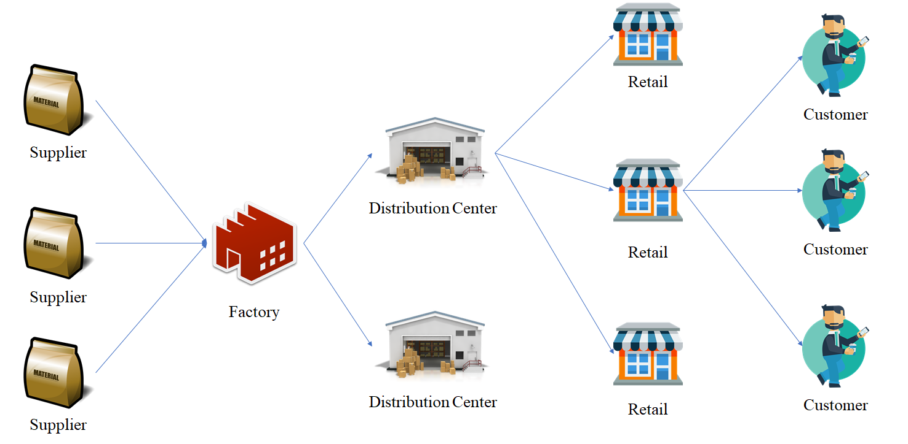

```{r setup, include=FALSE}
knitr::opts_chunk$set(echo = TRUE, fig.align = "center", eval = T)
```

# Introduction

All documentation and source code for this article is available at <a href = 'https://github.com/Argaadya/manufacturing/tree/master/Vehicle%20Routing%20Problem'> my github repository </a>.

## Background

Have you ever wondered how does your favorite snack arrived at your local market? Or how does your brand new shoes that you bought online delivered to your front door? Everything that you see at the store or delivered to you has gone through a long long journey, since your brand new shoes still in form of a pile of leathers and cottons until they come before your eyes in such a beatiful shape. This long journey can be described in a network, called *the supply chain*. The supply chain describe the flow of materials and goods from the first resource, the supplier, until it reach the customer. There are many variations of supply chain, one example is the following graph.

```{r }

```

Let's say you just bought a new smartphone. Before it became a product, its just a collection of materials and electronics. All materials from various suppliers is collected into a production plant or the factory where the product is made. After the smartphone has been produced and packaged, ready for sale, they have to be delivered into one or more distribution center. This distribution center is functioned as a warehouse to store the product before the they are shipped into various retail store. Only after the product has arrived at the retail store, you can finally see it and buy it. As you can see, there is a lot of process that need to be managed by various parties (suppliers, the producer, the warehouse manager) in order to deliver your favorite smartphone in time so they can make profit and make you happy. What would happened if the delivery processes are not managed properly? The product may come late because the truck that deliver the goods may go through the long path instead of the short one. This can also increase the cost of delivery, which in turn will increase the phone price, which in turn may lower your intention to buy the product and so the producer will not make a profit. Managing the delivery process is one of the most challenging task in supply chain management.

In this article, we will focus on managing the delivery process from a distribution center to various retail stores. How can we distribute all goods to all available shops with the shortest possible amount of distance/time? Since our concern is to reach an optimal amount of distance/time, this problem belongs to an optimization problem. The problem of managing route and visit all customers belong to the **Traveling Salesman Problem (TSP)**. The following figures represent the TSP. 

```{r out.width="60%"}
knitr::include_graphics("asset/tsp.png")
```

Each node or point represent a single location, be it a city or a house or a store and the line represent the route from a point to the next one.

> Given a list of cities and the distances between each pair of cities, what is the shortest possible route that visits each city and returns to the origin city?

So, if we have a warehouse in Seattle and want to distribute our product to a list of cities around the United States via land transportation, what is the shortest possible path? However, we have only a single route from the graph, which means that we have only a single truck to deliver all of the product. This seems impractical in a real world scenario where company always have a fleet of trucks to deliver the product. Thus, we should have more than a single route because we have more than a single truck. This variant of TSP belong to a problem called the **Vehicle Routing Problem**. Vehicle Routing Problem (VRP) involves the service of a set of customer with known demands by a fleet of vehicles from a single distribution center. The objective of the VRP is to minimize the total distance and the number of vehicles which start and end their tours at the central depot. In this article, we will focus on a specific problem of VRP called the **Capacitated Vehicle Routing Problem** and how to solve it using the **Nearest Neighbour Algorithm** and **Genetic Algorithm**.

## Objective

This article is dedicated to give my best explanation for:

* Capacitated Vehicle Routing Problem (CVRP)
* Nearest Neighbour Algorithm and its application in CVRP
* Genetic Algorithm and its application in CVRP

## Library and Setup

The algorithm is written in R programming language and requires the following package if you wish to reproduce the code.

```{r message=FALSE, warning=FALSE}
library(tidyverse)
library(ggrepel)
library(GA)
```

# General Concept

## Capacitated Vehicle Routing Problem

Capacitated Vehicle Routing Problem (CVRP) is a variant of VRP where a fleet of homogeneous vehicles has to serve a set of customers. Each customer can be visited more than once contrary to what is usually assumed in the classical vehicle routing problem (VRP). No constraint on the number of available vehicles is considered. There is a single depot for the vehicles and each vehicle has to start and end its tour at the cross depot. The objective is to find a set of vehicle routes that serves all the customers such that the sum of the quantities delivered in each tour does not exceed the capacity of the vehicle and the total distance travelled is minimized. 

The following graph is an example of CVRP.

```{r out.width="60%", echo=FALSE}

```

The CVRP has its own unique challenge because we have to manage a number of vehicle with limited carrying capacity and minimize their total travel distance. It is known that the CVRP is an NP-hard problem in which its real-life applications are considerably large in scale and finding the optimal solution of an instance is very hard and requires very long computational time. Therefore, metaheuristics are often more suitable for practical applications and have been applied for CVRP to find a near
optimal solution in a reasonable amount of time.

## Nearest Neighbour Algorithm

Nearest Neighbour Algorithm is a simple algorithm where it will look for the closest node for the next destination.  Instead of enumerating all possibilities, nearest neighbour only concern with the closest neighbour, node that has the shortest distance from the current position. The distance between node can be calculated using **Euclidean Distance** on the node coordinate (will be discussed further below). For CVRP, there are 2 variant of nearest neighbour algorithm that can be employed to solve the problem[^1]:

* Algorithm A

The first algorithm search for the Hamiltonian Cycle[^2] and then split the route into several sub-route according to the number of vehicle.

> A Hamiltonian cycle is a closed loop on a graph where every node (vertex) is visited exactly once. A loop is just an edge that joins a node to itself; so a Hamiltonian cycle is a path traveling from a point back to itself, visiting every node en route.

The step-by-step for this algorithm is as follows:

1. Use Nearest Neighbour Algorithm to find the giant path (Hamiltonian Cycle), start from the depot and also finish at the depot.

2. Route new vehicle on giant path serving the various nodes of the path till its capacity exhausted.

3. Route vehicle back to the depot station.

4. Calculate the total cost incurred for all vehicles.

Below is the illustration of the first algorithm.

```{r out.width="80%", echo=FALSE}
knitr::include_graphics("asset/nearest_a.gif")
```

* Algorithm B

The second algorithm assign individual vehicles to make a route until its capacity is exhausted and go back to the depot.

The step-by-step for this algorithm is as follows:

1. Route new vehicle using nearest neighbor strategy, starting from depot till its capacity exhausted.

2. Route back the vehicle to CD. If the demand is partially fulfilled, it will be visited again by the next vehicles.

3: Calculate the total cost incurred for the vehicle.

Below is the illustration of the second algorithm.

```{r out.width="80%", echo=FALSE}

```

According to the research paper, the second algorithm is proven to be better. We will explore them further in later section.

## Genetic Algorithm

To compare the performance of Nearest Neighbour Algorithm, we will use a general purpose, meta-heuristic method called Genetic Algorithm. Compared to a heuristic method, which is only work for specific problem, Genetic Algorithm is more flexible and can handle various problem. Genetic Algorithm has been proven to be able to solve CVRP[^4].

Genetic Algorithm is an optimization algorithm that use the concept of evolution by natural selection. Evolution by natural selection, as proposed by Charles Darwin, is the mechanism on how many varieties of living things are adapting to their environment to survive, through 2 main principles: natural selection and random mutation. The genetic algorithm (GA) borrowed the concept and use it to gain optimal solutions by selecting the best or the fittest solution alongside the rare and random occurence of mutation. The detail and another illustrattive case of Genetic Algorithm can be found at my another post[^3]. Below is the general flow of Genetic Algorithm:

```{r out.width="30%", echo=FALSE, eval =TRUE}

```

There are several advantages of Genetic Algorithm:

* Genetic Algorithm can escape local optima
* Can handle complex problem with many decision variables and big solution space
* It considers many points in the searching space simultaneously, not a single point, to deal with large
parameter spaces. 
* Can be parallelized since GA consists of multiple chromosomes/solutions
* Support multi-objective optimization

# Case Study

## Data

The data come from Christofides and Eilon[^5]. The datasets consists of 13 instances or problems. For illustration, we will load the instance `E-nn2-k4`, which means that it is from `set E` and the data consists of 22 nodes/points and 4 vehicles. The first node is the depot/warehouse and the rest is the customer. The location of each node is represented in cartesian coordinate with `x1` and `x2`. The demand for each node is also mentioned.

```{r }
route <- read.csv("data_input/E-n22-k4.csv")
route
```

We will visualize the position of the depot and the customer. The red dot represent the depot or station center. Our job is how to distribute our fleet of 4 vehicles into 21 different locations, each with their own respective demand. Our goal is to create distribution routes that will cover all customer with minimum distance.

```{r echo=F}
route %>% 
  ggplot(aes(x1,x2))+
  geom_point()+
  geom_point(data = route[1,], color = "red", size = 5)+
  theme_minimal() +
  theme(axis.title = element_text(size = 14),
        axis.text = element_text(size = 8))+
  labs(x = quote(x[1]),
       y = quote(x[2]),
       title = "Depot and Customer Location")
```

## Objective Function

The objective function for this problem is to minimize the total travel distance.

$$ min\ Z = \Sigma_{i=1}^{j=N} D_{ij}$$

$D_{ij}$ = distance between point $i$ to point $j$

## Distance

Since we want to minimize the distance, we will calculate the distance between locations with **Euclidean Distance**.

$$D_{ij} = \sqrt{(x_{1i}-x_{1j})^2 + (x_{2i}-x_{2j})^2}$$

Below is the sample of distance matrix between locations.

```{r}
route_distance <- dist(route[ , 2:3], upper = T, diag = T) %>% as.matrix()
head(route_distance)
```

## Optimization

We will now compare the performance of Nearest Neighbour with the Genetic Algorithm.

### Nearest Neighbour

#### Algorithm A

On algorithm A, we need to define the Hamiltonian Cycle first.

```{r}
source("script/nearest_a.R")

best_route <- list(total_distance = Inf)

for (i in 1:10^4) {
  try_route <- giant_path(demand = route$demand, distance =  route_distance)
  
  if (best_route$total_distance > try_route$total_distance) {
    best_route <- try_route
  }
}

best_route
```

Let's visualize the giant path.

```{r echo=FALSE}
best_route$route %>% 
  as.data.frame() %>% 
  rename(from = ".") %>% 
  mutate(to = lead(from)) %>% 
  slice(- nrow(.)) %>% 
  left_join(route, by = c("from" = "node")) %>% 
  rename(from_x1 = x1,
         from_x2 = x2) %>% 
  left_join(route, by = c("to" = "node")) %>% 
  rename(to_x1 = x1,
         to_x2 = x2) %>% 
  rename(demand = demand.y) %>% 
  select(-demand.x) %>% 
  ggplot() +
  geom_point(data = route, aes(x1,x2), show.legend = F) +
  geom_curve(aes(x = from_x1, xend = to_x1, y = from_x2, yend = to_x2), curvature = -0.05, color = "skyblue3",
               size = 0.5, alpha = 0.7, arrow = arrow(type = "closed", angle = 30, length = unit(3, "mm")) ) +
  geom_point(data = route[1,], aes(x1,x2), color = "red", size = 3) +
  geom_label_repel(data = route, aes(x1,x2, label = node), alpha = 0.7) +
  scale_color_manual(values = c("firebrick", "orange", "dodgerblue", "green3"))+
  theme_minimal() +
  theme(panel.grid = element_blank()) +
  theme(legend.position = "top") +
  labs(x = quote(x[1]),
       y = quote(x[2]),
       title = "Shortest Giant Path") 
```

Next, we just need to divide the giant into 4 separate routes that satisfy the capacity constraint.

```{r}
nearest_result <- assign_vehicle(x = best_route$route, demand = route$demand, capacity = 6000, distance = route_distance)
nearest_result
```

The total distance for this problem according to Algorithm A is 449. We can visualize the route for each vehicle.

```{r echo=FALSE}
nearest_result$route %>% 
  as.data.frame() %>% 
  rename(from = ".") %>% 
  mutate(to = lead(from)) %>% 
  slice(- nrow(.)) %>% 
  left_join(route, by = c("from" = "node")) %>% 
  rename(from_x1 = x1,
         from_x2 = x2) %>% 
  left_join(route, by = c("to" = "node")) %>% 
  rename(to_x1 = x1,
         to_x2 = x2) %>% 
  rename(demand = demand.y) %>% 
  select(-demand.x) %>% 
  mutate(unit = c( rep("A", 8), rep("B", 6), rep("C", 6), rep("D", 5))) %>% 
  ggplot() +
  geom_point(data = route, aes(x1,x2), show.legend = F) +
  geom_curve(aes(x = from_x1, xend = to_x1, y = from_x2, yend = to_x2, color = unit), curvature = -0.05,
               size = 0.5, alpha = 0.7, arrow = arrow(type = "closed", angle = 30, length = unit(3, "mm")) ) +
  geom_point(data = route[1,], aes(x1,x2), color = "red", size = 3) +
  geom_label_repel(data = route, aes(x1,x2, label = node), alpha = 0.7) +
  scale_color_manual(values = c("firebrick", "orange", "dodgerblue", "green3"))+
  theme_minimal() +
  theme(panel.grid = element_blank()) +
  theme(legend.position = "top") +
  labs(x = quote(x[1]),
       y = quote(x[2]),
       title = "Vehicle Routing Problem with Nearest Neighbour",
       subtitle = "Vehicle Capacity = 6000",
       color = "Unit") 
```

The result is still quite messy and perhaps is not the optimal solution. Next, we will try the algorithm B and compare the result.

#### Algorithm B

We will use the second nearest neighbour algorithm. Remember that in algorithm B, we will directly search the closest path for individual vehicle.

```{r}
source("script/nearest_b.R")
```

The starting point is randomized. So, in order to acquire the best solution, we will iterate the algorithm 10,000 times.

```{r}
best_route <- list(total_distance = Inf)

for (i in 1:10^4) {
  try_route <- nearest_b(demand = route$demand, distance = route_distance, capacity = 6000)
  
  if (best_route$total_distance > try_route$total_distance & try_route$vehicle_num <= 4) {
    best_route <- try_route
  }
}

best_route
```

From the result, we can see that the total distance is 410 with 4 vehicles. Thus, algorithm B can create a shorter path compared to algorithm A. Several location is visited twice. We can visualize the route into following graph.

```{r echo=FALSE}
best_route$route %>% 
  as.data.frame() %>% 
  rename(from = ".") %>% 
  mutate(to = lead(from)) %>% 
  slice(- nrow(.)) %>% 
  left_join(route, by = c("from" = "node")) %>% 
  rename(from_x1 = x1,
         from_x2 = x2) %>% 
  left_join(route, by = c("to" = "node")) %>% 
  rename(to_x1 = x1,
         to_x2 = x2) %>% 
  rename(demand = demand.y) %>% 
  select(-demand.x) %>% 
  mutate(unit = c( rep("A", 9), rep("B", 6), rep("C", 7), rep("D", 6))) %>% 
  ggplot() +
  geom_point(data = route, aes(x1,x2), show.legend = F) +
  geom_curve(aes(x = from_x1, xend = to_x1, y = from_x2, yend = to_x2, color = unit), curvature = -0.05,
               size = 0.5, alpha = 0.7, arrow = arrow(type = "closed", angle = 30, length = unit(3, "mm")) ) +
  geom_point(data = route[1,], aes(x1,x2), color = "red", size = 3) +
  geom_label_repel(data = route, aes(x1,x2, label = node), alpha = 0.7) +
  scale_color_manual(values = c("firebrick", "orange", "dodgerblue", "green3"))+
  theme_minimal() +
  theme(panel.grid = element_blank()) +
  theme(legend.position = "top") +
  labs(x = quote(x[1]),
       y = quote(x[2]),
       title = "Vehicle Routing Problem with Nearest Neighbour",
       subtitle = "Vehicle Capacity = 6000",
       color = "Unit") 
```

The route is look better than the previous one. 

### Genetic Algorithm

Before we run the Genetic Algorithm, first we need to setup the parameter. Genetic Algorithm will run with population size of 100 for 100,000 iterations/generations to ensure the solution convergence. The mutation probability is set to 0.1 while crossover probability is 0.8. The mutation is done using swap/exchange mutation method while for the crossover method I use the order crossover.

The encoding for the solution is in *Permutation Encoding* with the following scheme:

$$ 2, 3, 4, ..., N$$

with $N$ is the number of all available node.

The encoding will be translated into the traveling routes via the following steps:

1. Add 1 (the depot) at the start and the end of the route.
2. Go through the route and calculate the total demand along the way.
3. If the total demand is more than the vehicle capacity, the vehicle will go back to depot and the next destination will be served by the next vehicle.
4. Calculate the total distance from all vehicles.

The limitation of this method is that it assumed that each customer can only be visited once. After we acquire the routes, we will calculate the total distances. In order to speed up the convergence, we will insert the giant path from Nearest Neighbor Algorithm as suggestions for the initial population. The population size is 100, so we will also create 100 suggestions in form of matrix.

```{r}
suggestion_route <- matrix(ncol = (max(route$node)-1), nrow = 100)
  
  for (i in 1:100) {
    try_route <- giant_path(demand = route$demand, distance =  route_distance)
    
    suggestion_route[i, ] <- try_route$route[2:max(route$node)] %>% as.numeric()
  }

head(suggestion_route)
```

We run the Genetic Algorithm with the mentioned parameter.

```{r eval=FALSE}
source("script/fitness.R")

ga_route <- ga(type = "permutation", fitness = fitness, capacity = 6000, demand = route$demand, distance = route_distance, 
               lower = 2, upper = max(route$node), 
               mutation = gaperm_swMutation, popSize = 100, pmutation = 0.1, maxiter = 5 * 10^4, 
               suggestions = suggestion_route, monitor = F, seed = 123)

summary(ga_route)
```
```{r echo=FALSE}
source("script/fitness.R")
ga_route <- read_rds("ga_output/ga_e224.Rds")
summary(ga_route)
```

We can also see the progress on the algorithm by visualizing its fitness value across generations.

```{r}
plot(ga_route)
```

The total distance that we can achieve with Genetic Algorithm is 375, far lower than the Nearest Neighbour Algorithm. There are several solutions that can be used to reach the minimum total distance. Let's check if there is any duplicated solution.

```{r }
any(ga_route@solution %>% as.matrix() %>% duplicated(.))
```

There is no duplicated solution, meaning that each solution is equally feasible to be used as the solution. Here is the interpretation of the first solution after we transform the encoding into real travel route.

```{r }
solution_explain <- fitness_explain(ga_route@solution[1, ], capacity = 6000, 
                                    distance = route_distance, demand = route$demand)

solution_explain
```

The route for each vehicle would be:

* Vehicle 1: 1 -> 10 -> 8 -> 6 -> 3 -> 2 -> 7 -> 1
* Vehicle 2: 1 -> 13 -> 16 -> 19 -> 21 -> 18 -> 1
* Vehicle 3: 1 -> 17 -> 20 -> 22 -> 15 -> 1
* Vehicle 4: 1 -> 14 -> 12 -> 5 -> 4 -> 9 -> 11 -> 1

The total demand fulfilled for each vehicle is close to the vehicle capacity. We can visualize the result.

```{r echo=FALSE}
solution_explain$route %>% 
  as.data.frame() %>% 
  rename(from = ".") %>% 
  mutate(to = lead(from)) %>% 
  slice(- nrow(.)) %>% 
  left_join(route, by = c("from" = "node")) %>% 
  rename(from_x1 = x1,
         from_x2 = x2) %>% 
  left_join(route, by = c("to" = "node")) %>% 
  rename(to_x1 = x1,
         to_x2 = x2) %>% 
  rename(demand = demand.y) %>% 
  select(-demand.x) %>% 
  mutate(unit = c( rep("A", 7), rep("B", 6), rep("C", 5), rep("D", 7))) %>% 
  ggplot() +
  geom_point(data = route, aes(x1,x2), show.legend = F) +
  geom_segment(aes(x = from_x1, xend = to_x1, y = from_x2, yend = to_x2, color = unit), 
               size = 0.5, alpha = 0.7, arrow = arrow(type = "closed", angle = 30, length = unit(3, "mm")) ) +
  geom_point(data = route[1,], aes(x1,x2), color = "red", size = 3) +
  geom_label_repel(data = route, aes(x1,x2, label = node), alpha = 0.7) +
  scale_color_manual(values = c("firebrick", "orange", "dodgerblue", "green3"))+
  theme_minimal() +
  theme(panel.grid = element_blank()) +
  theme(legend.position = "top") +
  labs(x = quote(x[1]),
       y = quote(x[2]),
       title = "Capacitated Vehicle Routing Problem with Genetic Algorithm",
       subtitle = "Vehicle Capacity = 6000",
       color = "Unit") 
```

# Conclusion

Genetic Algorithm can achieve better solution than Nearest Neighbour alone for the first instance problem. However, we should also check the performance on another problem as well. After we have done several testing toward all of the problems instance, the following table shows the performance of each algorithm toward each instance problem compared to the true optimal solution. `NA` value indicate that no feasible solution is found by the algorithm.

```{r echo=FALSE}
nearest_a_result <- read.csv("ga_output/nearest_a.csv") %>% slice(-c(1:2,8:9))
nearest_b_result <- read.csv("ga_output/nearest_b.csv") %>% slice(-c(1:2,8:9))
ga_result <- read.csv("ga_output/ga_result.csv")

data.frame(Problem = nearest_a_result$problem,
           NN_A = ifelse(nearest_a_result$vehicle_num == c(4, 3, 3, 4, 5), round(nearest_a_result$total_distance, 3), NA),
           NN_B = ifelse(nearest_b_result$vehicle_num == c(4, 3, 3, 4, 5), round(nearest_b_result$total_distance, 3), NA),
           GA = ga_result$total_distance %>% round(3),
           True_Optimal = c(375, 569, 534, 835, 521))
```

The true optimal shows the actual optimal value and available for each instance problem, which serves as a benchmark for any researcher who wish to create a new method and compare their performance either with the optimal value itself or with other previous methods.

The Nearest Neighbour with Algorithm A (draw the giant path first) is not able to generate feasible solution for most of instances. This is because the algorithm give a solution that violate the total number of vehicles. The closest destination may have higher total demand compared to next closest one, making the vehicle more frequently go back to the depot. Meanwhile, the Nearest Neighbour with Algorithm B is better than the first algorithm, although it still unable to achieve optimal solution. Both algorithms are fast to implement and only took seconds to complete.

Genetic Algorithm with nearest neighbour as the initial population has shown a great performance, achieving near optimality in some solutions even though Genetic Algorithm is a meta-heuristic method and does not specifically designed to solve this problem. With the increase of the problem size, 100,000 iterations may not be enough and need more iterations to converge. However, the main drawback of Genetic Algorithm is its computation time, which is far longer compared to the Nearest Neighbour. The algorithm computation time is heavily depends on the problem size and the number of iterations. This algorithm can still be improved in order to solve CVRP by changing the parameter, such as the selection, crossover and mutation methods, on which some researchers have designed an improved operator[^6]. Improving Genetic Algorithm will create a better solution with faster convergence.

# Reference

[^1]: [Capacitated Vehicle Routing Using Nearest Neighbor Algorithm in Supply Chain](https://www.ijert.org/research/capacitated-vehicle-routing-using-nearest-neighbor-algorithm-in-supply-chain-IJERTV3IS051534.pdf)
[^2]: [Hamiltonian Cycle](https://www.statisticshowto.datasciencecentral.com/hamiltonian-cycle/)
[^3]: [Genetic Algorithm](https://algotech.netlify.com/blog/optimization-with-genetic-algorithm/)
[^4]: [An Effective Genetic Algorithm for Capacitated Vehicle Routing Problem](http://ieomsociety.org/ieom2018/papers/105.pdf)
[^5]: [CVRP Benchmark Dataset](http://vrp.galgos.inf.puc-rio.br/index.php/en/)
[^6]: [Optimised Crossover Genetic Algorithm for Capacitated Vehicle Routing Problem](https://www.sciencedirect.com/science/article/pii/S0307904X11005105?via%3Dihub)
